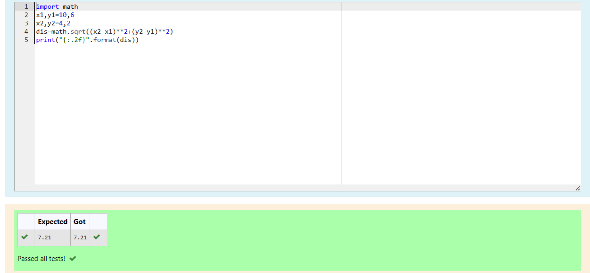

# DISTANCE-BETWEEN-TWO-POINTS

## AIM:
To write a python program to find the distance two 2 points
## ALGORITHM:
### Step 1: 
Import the math module using `import math`.
### Step 2: 
Define the coordinates of the two points using x1, y1,x2 and y2 and assign it with respective given values.
### Step 3: 
Substitute the values in the distance formula  
### Step 4:
 Format and print the output to two decimal places.

### Step 5:
End the program
### PROGRAM:
```PY
import math
x1,y1=10,6
x2,y2=4,2
dis=math.sqrt((x2-x1)**2+(y2-y1)**2)
print("{:.2f}".format(dis))
```
  


### OUTPUT:


### RESULT:
Thus  finding distance between two 2 points program  was executed successfully.
